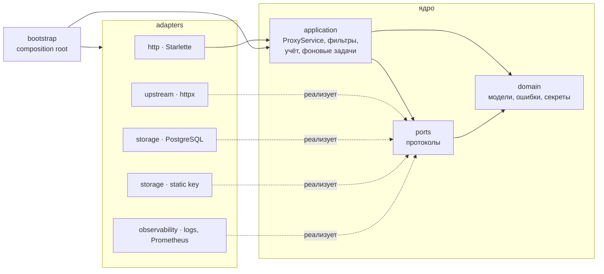
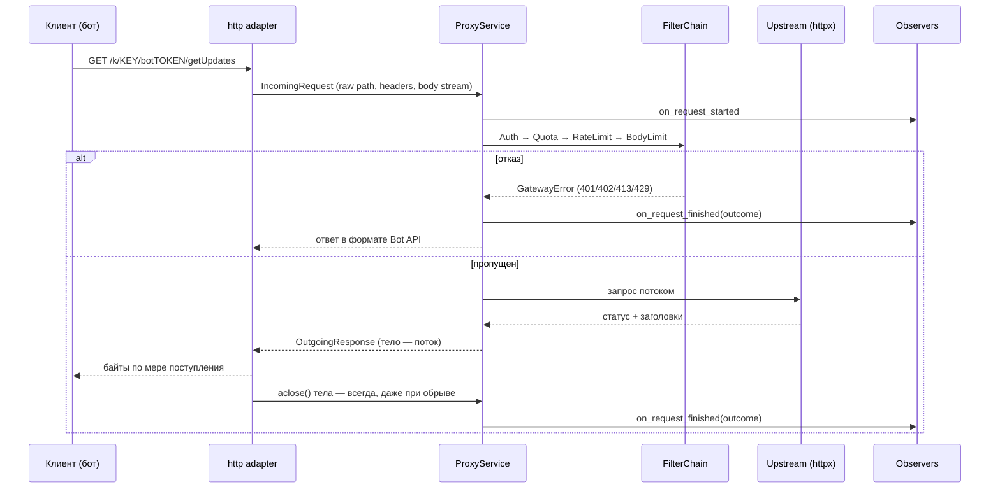
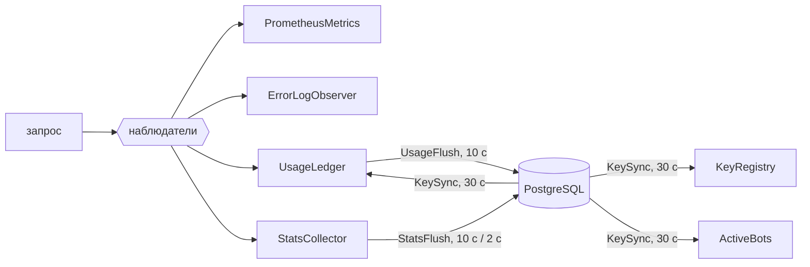

# Архитектура tg-relay

## Главные требования

Архитектура выведена из четырёх требований к шлюзу:

1. **Прозрачность.** Байты запроса и ответа проходят без изменений; шлюз не знает
   методов Bot API.
2. **Токен не сохраняется.** Ни в логах, ни в базе, ни в метриках: только отпечаток.
3. **База не на пути запроса.** Падение PostgreSQL не должно останавливать ботов.
4. **Узлы взаимозаменяемы.** Никакого локального состояния, которое нельзя потерять.

## Слои

Гексагональная архитектура (Ports & Adapters): зависимости направлены внутрь.

| Слой | Что внутри | От чего зависит |
|---|---|---|
| `domain` | `ProjectAccess`, `Limits`, `RequestOutcome`, ошибки шлюза, хеши и отпечатки, разбор пути Bot API | только от стандартной библиотеки |
| `ports` | `KeySource`, `UsageRepository`, `StatsRepository`, `Upstream`, `RequestObserver` | `domain` |
| `application` | `ProxyService`, цепочка фильтров, `KeyRegistry`, `RateLimiter`, `UsageLedger`, `StatsCollector`, фоновые задачи | `domain`, `ports` |
| `adapters` | Starlette, httpx, asyncpg, prometheus-client, logging | ядро |
| `bootstrap` | сборка узла из `Settings` | всё |

Почему именно так:

- **Автономный режим и режим с базой** отличаются только набором адаптеров,
  а не ветками `if` в коде проксирования.
- **Ядро тестируется без сети и базы**: в `tests/support/fakes.py` лежат
  in-memory реализации портов.
- **Другое хранилище** (Redis для общего rate limit, ClickHouse для статистики)
  подключается новым адаптером, без правок ядра.

## Путь запроса

Важные детали:

- **Путь не перекодируется.** HTTP-адаптер берёт `raw_path` из ASGI-scope, и до
  upstream доходят исходные `%XX`.
- **Заголовки.** Срезаются только hop-by-hop заголовки (RFC 9110 §7.6.1), включая
  перечисленные в `Connection`. Порядок и дубликаты сохраняются. Шлюз не добавляет
  своих заголовков: запрос к upstream собирается напрямую через `httpx.Request`,
  поэтому `User-Agent: python-httpx` клиента по умолчанию не подмешивается.
- **Итог запроса фиксируется ровно один раз**, когда тело ответа отдано, оборвано
  или закрыто без чтения (`_RelayedBody.aclose` идемпотентен). Соединение
  с upstream возвращается в пул, а gauge `relay_inflight_requests` не «течёт».
- **Сбой наблюдателя не ломает ответ**: исключение в метриках или учёте
  логируется и не выходит наружу.

## Фильтры

Каждый фильтр — вызываемый объект с сигнатурой `async (ctx) -> None`, который
либо пропускает запрос, либо бросает доменную ошибку. Порядок задаётся в
`bootstrap.py`:

| Фильтр | Ошибка | Когда включён |
|---|---|---|
| `AuthFilter` | 401 | всегда |
| `QuotaFilter` | 402 | база есть и `ENFORCE_LIMITS=true` |
| `RateLimitFilter` | 429 + `retry_after` | база есть и `ENFORCE_LIMITS=true` |
| `BodyLimitFilter` | 413 | всегда; проверяет и `Content-Length`, и фактический поток |

Новая политика (белый список IP, лимит на конкретный метод) — это новый класс
и одна строка в `bootstrap.py`.

### Лимит ботов

`QuotaFilter` ограничивает число ботов, **работающих одновременно**, а не всех,
кто заходил за месяц. Состояние держит `ActiveBots`: для каждого бота (по
отпечатку токена) — момент последнего запроса.

- Бот занимает место **в момент прохождения фильтра**, а не по завершении
  запроса: первый запрос бота обычно long poll на десятки секунд, и за это
  время место успел бы занять другой бот.
- Бот, промолчавший дольше `ACTIVE_BOT_WINDOW`, место освобождает. Окно должно
  быть заметно больше `timeout` long polling (по умолчанию 300 с против ≤ 60 с).
- Бот, получивший `402`, места не занимает и в учёт как бот проекта не попадает:
  иначе отказ записал бы его в работающие, и следующий запрос прошёл бы.
- `UsageLedger` отдаёт бота в каждой пачке, где он работал, и в базе обновляется
  `active_bots.last_seen`. `KeySync` подмешивает эту активность обратно в
  `ActiveBots`, поэтому лимит переживает рестарт узла и общий для нескольких
  узлов с точностью до `KEY_CACHE_TTL`.

## Учёт и синхронизация

- **Счётчики прибавляются**, а не перезаписываются
  (`INSERT … ON CONFLICT DO UPDATE SET x = x + EXCLUDED.x`), поэтому несколько
  узлов не затирают друг друга.
- **Сбой записи не теряет данные.** Пачка возвращается в память и уходит при
  следующей попытке. Разные виды данных сбрасываются независимо: если упала
  запись журнала ошибок, почасовая статистика не запишется повторно.
- **Удалённые проекты не блокируют сброс.** Строки проектов, которых уже нет,
  отбрасываются условием `WHERE EXISTS`. Без этого одно нарушение внешнего
  ключа откатывало бы всю пачку, и сброс повторялся бы вечно.
- **Трафик месяца и активность ботов для лимитов** берутся как максимум из
  локального значения и значения в базе (там учтены все узлы). Поэтому лимит мягкий: возможен
  перерасход в пределах интервала синхронизации, но ложного отказа из-за
  недоступной базы не бывает.
- **При остановке** фоновые задачи отменяются и выполняется финальный сброс.

## Жизненный цикл узла

1. `Settings.from_env()` проверяет конфигурацию; при ошибке шлюз сразу падает.
2. `Gateway.start()`: подключение к базе, миграции под advisory-lock, при
   необходимости создание bootstrap-проекта, первая загрузка ключей и запуск
   фоновых задач.
3. `/readyz` отвечает `200`, когда ключи загружены.
4. По SIGTERM узел сразу становится неготовым (`/readyz` → `503`), uvicorn
   даёт висящим запросам `SHUTDOWN_GRACE` секунд, а `Gateway.stop()` делает
   финальный сброс и закрывает соединения.

## Схема базы

- [`001_core.sql`](../src/tg_relay/adapters/storage/postgres/migrations/001_core.sql):
  `projects`, `project_keys` (только SHA-256 ключа), `usage_counters`, `active_bots`.
- [`002_stats.sql`](../src/tg_relay/adapters/storage/postgres/migrations/002_stats.sql):
  `request_stats`, `request_errors`, `project_last_request`.
- [`003_bot_activity.sql`](../src/tg_relay/adapters/storage/postgres/migrations/003_bot_activity.sql):
  индекс по `active_bots.last_seen` для лимита одновременных ботов.
  Колонка `projects.monthly_bot_limit` сохранила имя ради совместимости, но
  означает «сколько ботов может работать одновременно».

Токенов нет ни в одной таблице, только 12-символьные отпечатки.
